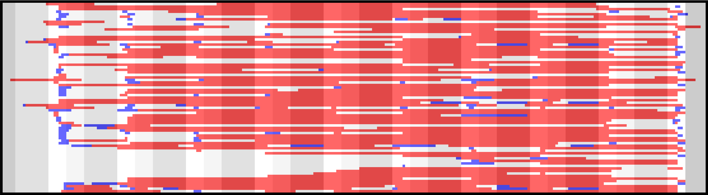
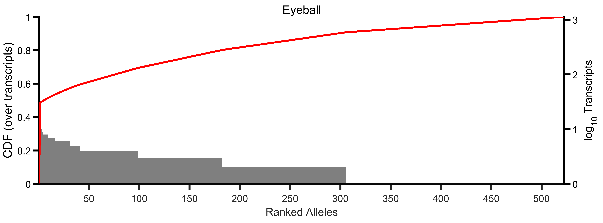
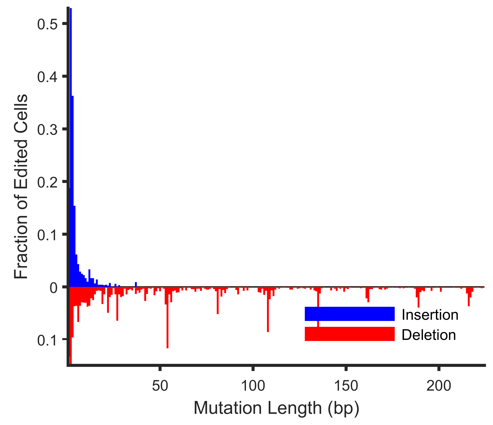
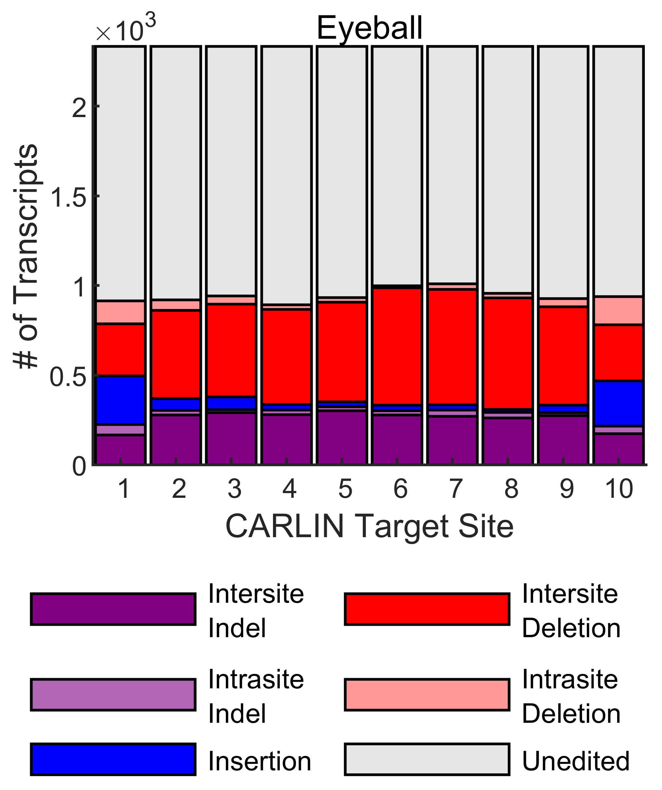
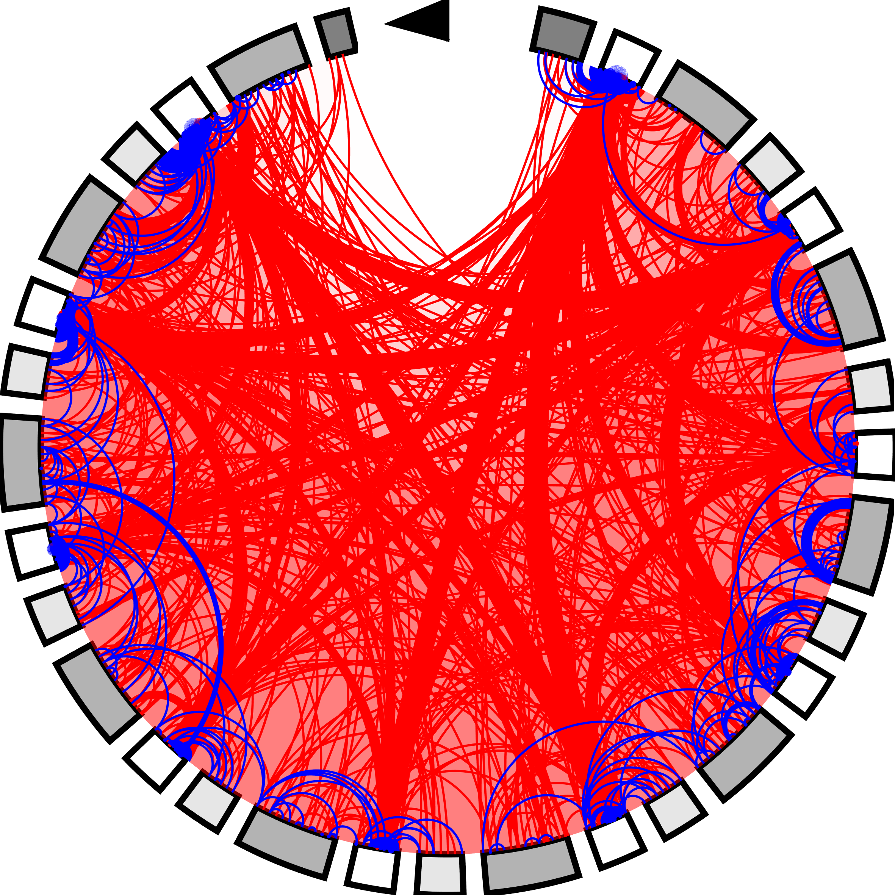

# CARLIN Pipeline

The CARLIN pipeline calls alleles from sequencing runs of the CARLIN amplicon. It was written in MATLAB 2019a.

## Citation

Please cite the [companion paper](https://doi.org/10.1016/j.cell.2020.04.048) if you use this software package:

> S. Bowling, D. Sritharan, F. G. Osorio, M. Nguyen, P. Cheung, 
A. Rodiguez-Fraticelli, S. Patel, W-C. Yuan, Y. Fujiwara, B. E. Li, S. H. Orkin, 
S. Hormoz, F. D. Camargo. "An Engineered CRISPR-Cas9 Mouse Line for 
Simultaneous Readout of Lineage Histories and Gene Expression Profiles 
in Single Cells." Cell (2020), https://doi.org/10.1016/j.cell.2020.04.048
>

To reproduce all the results and figures from the paper, please [visit the paper repository](https://gitlab.com/hormozlab/Cell_2020_carlin).

## Download

To download the pipeline into the directory given by CODE_PATH:

```bash
$ git clone https://gitlab.com/hormozlab/carlin.git CODE_PATH
```

## Installation

Install the CARLIN software by opening MATLAB, and running the following commands. Installation requires a C++ compiler, which should be included as part of your MATLAB installation if you are an academic user. If not, you can [download the free MinGW compiler](https://www.mathworks.com/support/requirements/supported-compilers.html).
	
```MATLAB
>> cd(CODE_PATH);
>> install_CARLIN;
```

If you are installing on your local machine, you should additionally save the path.

```MATLAB
>> savepath;
```

If you are installing on a cluster machine, the MATLAB path file will be read-only, so you will have to re-run the following command at the start of each session to set up paths:

```MATLAB
>> addpath(genpath(CODE_PATH));
```

You should also re-run the installation when you pull new changes from git.

## Usage

The entry point to the pipeline is the analyze_CARLIN function.

```MATLAB
>> help analyze_CARLIN 
```

    analyze_CARLIN calls alleles from FASTQs sequencing the CARLIN amplicon. 
 
    analyze_CARLIN(FASTQ_FILE, CFG_TYPE, OUTDIR) analyzes FASTQ_FILE 
    (*.fastq, *.fastq.gz) generated according to CFG_TYPE (one of 'BulkDNA', 
    'BulkRNA', 'scInDropsV2', 'scInDropsV3', 'sc10xV2', 'sc10xV3') and saves the 
    following files to OUTDIR:

    Analysis.mat.gz - contains all variables including a compactified 
      representation of the FastQ files, a depot of unique aligned
      sequences, the collection of CBs and UMIs detected before and after 
      denoising, and the called alleles. This file may be large, and is not
      intended for use by a casual-user, rather to save state to do any
      custom one-off analysis.

    Summary.mat - contains a subset of the variables in Analysis.mat that 
      are usually sufficient for subsequent downstream analysis in MATLAB
      including a list of alleles, their frequencies, tags (UMIs or CBs) 
      reporting that allele, input parameters, thresholds used by the 
      algorithm - and, for SC runs - the reference barcode list.

    Alleles.png - Plot of sequence and distribution of alleles with
        summary statistics.

    AlleleAnnotations.txt - Annotations describing each allele in plaintext
      format (HGVS) for use by other downstream tools.

    AlleleColonies.txt - List of tags (UMIs or CBs) which report each
      allele, for use by other downstream tools. The ordering corresponds 
      to AlleleAnnotations.txt

    Results.txt - Human-readable summary of the analysis results.

    Diagnostic.png - Detailed dashboard of various diagnostic quantities.

    Warnings.txt - List of issues detected in the data.

    Log.txt - Running log of the pipeline.

    The pipeline can optionally be invoked with some extra paramters:

    analyze_CARLIN(..., 'read_cutoff_UMI_denoised', cutoff) uses a minimum
    read threshold of 'cutoff' when attempting to call alleles from denoised 
    UMIs (default = 10). This cutoff is not used in its raw form, but
    combined as part of a cutoff function. It represents an absolute floor,
    but the cutoff used in practice will generally be higher.

    analyze_CARLIN(..., 'read_override_UMI_denoised', cutoff) short circuits
    the cutoff function, and sets the threshold to 'cutoff'. All UMIs with a
    read count >= 'read_override_UMI_denoised' will be asked to call an allele. 
    Default is unset.

    For bulk sequencing runs (CFG_TYPE='Bulk*'):

    analyze_CARLIN(..., 'max_molecules', N) considers (at most) the N denoised
    UMIs with the most reads, for calling alleles. For CFG_TYPE='BulkDNA',
    N is the number of cells in the sample. For CFG_TYPE='BulkRNA', N is the 
    number of transcripts (if unsure, 10x the number of cells is suitable
    guess). Default is inf.
    
    For single-cell sequencing runs of the CARLIN amplicon (CFG_TYPE='sc*'):

    analyze_CARLIN(..., 'max_cells', N) considers (at most) the N denoised
    cell barcodes with the most reads, for calling alleles. Defaults to 
    the number of possible CBs in the single-cell platform specified by
    CFG_TYPE.

    analyze_CARLIN(..., 'read_cutoff_CB_denoised', cutoff) uses a minimum
    read threshold of 'cutoff' when attempting to call alleles from denoised 
    CBs (default = 10). This cutoff is not used in its raw form, but
    combined as part of a cutoff function. It represents an absolute floor,
    but the cutoff used in practice will generally be higher.

    analyze_CARLIN(..., 'read_override_CB_denoised', cutoff) short circuits
    the cutoff function, and sets the threshold to 'cutoff'. All CBs with a
    read count >= 'read_override_CB_denoised' will be asked to call an allele. 
    Default is unset.

    analyze_CARLIN(..., 'ref_CB_file', file) uses the reference list of 
    cell barcodes in the file specified by 'ref_CB_file' when denoising 
    barcodes found in the FastQ files. The reference list should have one 
    cell barcode per line. Each cell barcode should be a string consisting 
    of only the characters {A,C,G,T}. The length of the barcode should match
    the length expected by the platform specified by CFG_TYPE. This reference
    list is typically produced by the software used to process the 
    corresponding transcriptome run. Defaults to the full barcode list in 
    the single-cell platform specified by CFG_TYPE. Specifying a reference
    list leads to more accurate denoising than using the full barcode list.

    Examples:

        % Run analysis on bulk RNA sample
        analyze_CARLIN('run1/PE.fastq.gz', 'BulkRNA', 'run1_output');

        % Run analysis on multiple sequencing runs of the same bulk DNA sample
        analyze_CARLIN({'run1/PE.fastq.gz'; run2/PE.fastq.gz'}, 'BulkDNA', 'combined_output');

        % Run analysis on sample prepared with InDropsV3
        analyze_CARLIN('indrops/amplicon/Lib1.fastq', 'scInDropsV3', ...
                       'output', 'ref_CB_file', 'indrops/transcriptome/abundant_barcodes.txt');

        % Run analysis on sample prepared with 10xGenomics V2
        analyze_CARLIN({'tenx/amplicon/Mouse_R1_001.fastq', 'tenx/amplicon/Mouse_R2_001.fastq'}, ...
                       'sc10xV2', 'tenx/processed_amplicon', ...
                       'ref_CB_file', 'tenx/transcriptome/filtered_barcodes_umi_mt.txt');
                      
    Author: Duluxan Sritharan. Hormoz Lab. Harvard Medical School.


## Outputs

The outputs are described in the MATLAB help screen captured above. The most important output is `Summary.mat` which stores all the information that should typically be required for any downstream analysis. 

Each run of the pipeline also produces a summary plot, with useful at-a-glance metrics in the top-left corner:

<p align=center></p>

Here's a brief look at the text outputs.

```bash
$ tail AlleleAnnotations.txt 
```
    50_157del,212_265del
    47_131del
    47A>T
    23_184del
    23_237del,262_267del
    23_23del,49_49delinsTC,104_105insCC,265_266insAC
    22_23insG,77_265del
    23_241del
    17_49delinsTCG,77_238del,266_266del
    17_150del,264_265del

```bash
$ head AlleleColonies.txt -n 20 | tail -n 10
```

    AATAGAGGTGAGACCA,CATACTTAGTCATCCA,CCTCAGTGTGCCTAAT,CGAAGGATCGTTCTGC,GAGATGGCAAAGGCTG,GGTGAAGCAACCCTAA,TCCTCTTTCACAGTGT
    AGATAGACAGCACCCA,GCGTTTCTCACAAGAA,GTAGTACTCAAAGCCT,GTGAGGATCTCGTCAC,GTGTAACAGAAACCCG,TAGGTTGTCACGATAC
    ATGGGAGTCATTACGG,CATTCTATCCGCACGA,GCTGAATGTGACACAG,GGGACCTGTCCTTAAG,TACGTCCCACCGGAAA,TTAGGCAAGCCACAAG
    CTCCACAGTGCGACAA,GCCAGGTGTTCCTAGA,GTAATCGTCATTGAGC,TGCTCGTCACACTTAG,TTCCGGTGTCATAACC
    CACCGTTGTGGACAGT,GAGTCTATCATTTACC,TGCTTGCTCGGTGAAG,TTCTAGTTCCACTTCG
    GACATCAGTGTCCCTT,TGCGGCAGTTATCCAG,TTCAGGAAGCTAGAAT,TTTCATGTCAACTACG
    GAACTGTTCGTGCTCT,TACCCACGTCACATTG,TCGATTTCATCCAATG,TTACCGCGTAATTAGG
    ACACAGTCATCGGAAG,CGTTGGGCAGATACCT,GCATTAGTCCCTTTGG
    AGGCTGCTCTCACTCG,ATGGGTTGTCTCGGGT,ATTCGTTCAACTCCCT
    CTAACCCAGCCTCACG,GTTACAGTCTATACTC,TGGATCACACAGCATT

```bash
 $ tail Results.txt
```

    ALLELES

    Total (including template):                                     83
    Singletons (including template):                                49
    % CBs edited:                                                   20
    Effective Alleles:                                              44
    Diversity Index (normalized by all):                          0.03
    Diversity Index (normalized by edited):                       0.17
    Mean CARLIN potential (by allele):                            5.24


```bash
$ cat Warnings.txt
```

    OFF-TARGET AMPLIFICATION

    Significant off-target amplification detected: 73% of reads are not CARLIN.

    REFERENCE_LIST

    Collapsing MiSeq cell barcodes against the platform's reference list may lead to more FPs and FNs.

    FILTERING

    Sequencing depth insufficent. Low number of reads detected in FASTQ.

    Only 61% of reads have usable provenance information (CB or UMI). See Results.txt for a more detailed breakdown of QC issues.

    ANALYSIS

    Number of common CBs is low (163). This is likely due to:
    - reads dedicated to FP CBs owing to the inflated reference list used
    - low sequencing depth so that many CBs do not exceed the required threshold
    - QC issues with CB/UMI which cause reads to be dedicated to spurious CBs that persist after filtering

    RESULTS

    Low +Dox induction detected. Only 0% of CBs reported an edited CARLIN allele.

    For allele(s) 1, >10% of CB halves or UMIs differ pairwise by only 1bp. This may indicate that that the cell count for these alleles is artificially inflated. This is likely because of QC issues on the CB/UMI reads. This is a known issue with InDrops.


## Statistical Significance of Alleles

A main contribution of the CARLIN paper is to quantify the statistical significance of alleles (see Methods). Cas9 editing does not generate all alleles with equal probability - those with complex editing patterns are more rare. The more common alleles are more likely to coincidentally mark multiple progenitors, and are therefore less useful for lineage tracing. Alleles that should be rare but are abundant in a particular experiment are statistically significant. 

Statistical significance is determined by comparing the observed frequency of an allele in an experiment, with the expected frequency. The observed frequency is stored in `summary.allele_freqs`, where `summary` is an `ExperimentSummary` object saved in `Summary.mat`. The expected frequency distribution can be determined by using the allele bank, (stored in the `bank` variable of `Bank.mat`), which is the same bank used in Figure 3 of the paper.

You can compute the two p-values described in Methods as shown:

```MATLAB	
>> load('Summary.mat');
>> load('Bank.mat');
>> p_clonal = bank.compute_clonal_pvalue(summary);
>> p_frequency = bank.compute_frequency_pvalue(summary);
```

The output in each case is a vector with elements corresponding to the alleles in `summary.alleles`.

## Create a Custom Bank

To create a custom bank characterizing the null distribution of allele frequencies for your own protocol, [download CatchAll](http://www.northeastern.edu/catchall/downloads.html) and copy the full path (including binary name) into:

	CODE_PATH/@Bank/CatchAllPath.txt

Run the following code to create a `bank` object from pooling three libraries (saved in directories `Mouse1`, `Mouse2`, and `Mouse3`), each processed separately using the CARLIN pipeline, and save the result in `MyCustomBank/Bank.mat`:

```MATLAB
>> mouse1 = load('Mouse1/Summary.mat');
>> mouse2 = load('Mouse2/Summary.mat');
>> mouse3 = load('Mouse3/Summary.mat');
>> bank = Bank.Create([mouse1.summary; mouse2.summary; mouse3.summary], {'Mouse1'; 'Mouse2'; 'Mouse3'}, 'MyCustomBank');
```

## Work with Mutations

A CARLIN allele is stored as two aligned strings - a sequence and a reference. To view the alignment of the fifth most common allele in the experiment:

```MATLAB
>> [summary.alleles{5}.get_seq; summary.alleles{5}.get_ref]
  
    ans =

      2×276 char array
    
        'CGCCGGACTGCACGACAGTCGACGATGGAGTCGACACGACTCGCGCATA------------------------------------------------------------------------------------------------------------------------------------------------------------------------------------------------------------------------CGATGGGAGCT'
        'CGCCGGACTGCACGACAGTCGACGATGGAGTCGACACGACTCGCGCATACGATGGAGTCGACTACAGTCGCTACGACGATGGAGTCGCGAGCGCTATGAGCGACTATGGAGTCGATACGATACGCGCACGCTATGGAGTCGAGAGCGCGCTCGTCGACTATGGAGTCGCGACTGTACGCACACGCGATGGAGTCGATAGTATGCGTACACGCGATGGAGTCGAGTCGAGACGCTGACGATATGGAGTCGATACGTAGCACGCAGACGATGGGAGCT'
```

To retrieve a list of mutations called from a set of alleles, and inspect the second mutation in the thirteenth allele:

```MATLAB
>> mut_list = cellfun(@Mutation.identify_Cas9_events, summary.alleles, 'un', false);
>> mut_list{13}(2)

    ans = 
    
      Mutation with properties:
    
             type: 'D'
        loc_start: 263
          loc_end: 266
          seq_new: '----'
          seq_old: 'AGAC'

>> mut_list{13}(2).annotate()

    ans =

        '263_266del'        
```

To output a list of mutations to a text file in HGVS format as shown in AlleleAnnotations.txt:

```MATLAB
>> Mutation.ToFile(mut_list, 'output_path', 'mootations.txt');
```

To construct CARLIN alleles from a list of mutations specified in HGVS format like AlleleAnnotations.txt:

```MATLAB
>> alleles = cellfun(@Mutation.apply_mutations, Mutation.FromFile('dootations.txt'), 'un', false);
```

## Visualization

This package also includes a few standard visualizations, that will produce figures like those shown in the paper. They all take an `ExperimentSummary` object as input. 

Visualize the top 75 most common edited alleles:
```MATLAB
>> plot_highlighted_alleles(summary, 75);
```
<p align=center></p>

Generate a CDF and histogram of allele frequencies:
```MATLAB
>> plot_allele_frequency_CDF(summary, 'Eyeball');
```
<p align=center></p>

Generate a histogram of mutations according to length (normalized by the number of cells in the experiment):
```MATLAB
>> plot_indel_freq_vs_length(summary);
```
<p align=center></p>

Summarize the different edit patterns at each target site:
```MATLAB
>> plot_site_decomposition(summary, true, 'Eyeball', '# of Transcripts');
```
<p align=center></p>

Visualize the editing patterns in more detail:
```MATLAB
>> plot_stargate.create(summary);
```
<p align=center></p>

## Troubleshooting

If you're running into issues, check if the CARLIN pipeline runs properly on test datasets on your installation.

```MATLAB
>> cd([CODE_PATH '/tests']);
>> runtests;
```

There are also examples in `tests/CARLIN_pipeline_test.m`, to check if your invocation is correct. For other examples of how the code is used, please [visit the paper repository](https://gitlab.com/hormozlab/Cell_2020_carlin).

#### Prepared By: Duluxan Sritharan
